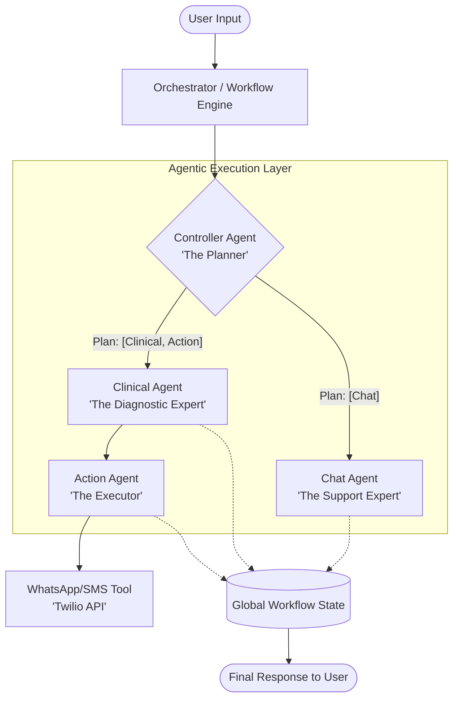

# 🏥 Swasthya360: Agentic AI Medical Assistant

**Swasthya360** is a state-of-the-art **Agentic AI** system designed to provide autonomous medical triage and support. Unlike traditional chatbots, Swasthya360 uses a sophisticated "Plan-and-Execute" architecture to analyze user symptoms, reason about medical risks, and execute autonomous actions such as triggering emergency alerts via WhatsApp.

---

## 🌟 Theme: Agentic AI Systems

This project is built strictly on **Agentic AI principles**. The system does not just reply to prompts; it:
1.  **Takes a Goal**: Understands complex user medical queries.
2.  **Reasons & Plans**: A central Controller Agent analyzes the intent and creates a multi-step execution plan.
3.  **Executes Actions**: Modular agents carry out specific tasks (Diagnosis, Risk Assessment, Emergency Alerts).
4.  **Uses Tools**: Interacts with real-world tools like the Twilio API for WhatsApp notifications.

---

## 🏗️ System Architecture

Swasthya360 employs a modular, graph-based orchestration layer powered by **LangGraph**.

### Architecture Diagram



---

## 🧠 How the Agent Works

The system follows a rigorous **Reasoning → Planning → Execution** cycle:

1.  **Reasoning (Controller Agent)**: 
    *   Analyzes the user's query, symptoms, and reported severity.
    *   Determines the intent: `chat`, `medical`, or `emergency`.
    *   Outputs a **Reasoning Path** explaining why a specific plan was chosen.

2.  **Planning**:
    *   The Controller generates a sequence of agents to invoke.
    *   *Example*: For a high-severity symptom, the plan might be `["clinicalAgent", "actionAgent"]`.

3.  **Execution (Specialized Agents)**:
    *   **Clinical Agent**: Uses Gemini 3.1 Flash to provide a structured medical assessment (Diagnosis, Confidence, Preventive Measures).
    *   **Action Agent**: Decides if an emergency alert is needed based on the assessment and triggers the `whatsappTool` if necessary.
    *   **Chat Agent**: Handles non-medical queries with empathy and guidance.

---

## 📝 Prompt Management (Transparency)

In compliance with hackathon guidelines, all AI prompts are **not hidden in code**. They are centralized and accessible for review and modification:

📍 **Path**: [`Backend/src/config/prompts.js`](file:///c:/Users/Uday%20Narayan/Swasthya360/Backend/src/config/prompts.js)

This file contains the system instructions for:
*   `CONTROLLER_AGENT`: Logic for intent classification and workflow planning.
*   `CLINICAL_AGENT`: Medical expertise and risk assessment guidelines.
*   `CHAT_AGENT`: Conversational tone and boundary setting.

---

## 🚀 Getting Started

### Prerequisites
- Node.js (v18+)
- Gemini API Key
- Twilio Account (for WhatsApp alerts)

### Installation

1.  **Clone the Repository**:
    ```bash
    git clone https://github.com/Udaytyagi004/Swasthya360.git
    cd Swasthya360
    ```

2.  **Backend Setup**:
    ```bash
    cd Backend
    npm install
    # Create .env file with your keys (see .env.example)
    npm start
    ```

3.  **Frontend Setup**:
    ```bash
    cd ../Frontend
    npm install
    npm run dev
    ```

---

## 🛡️ QA and Testing

We ensure reliability through multiple testing layers:

1.  **Manual UI Testing**: Validating the end-to-end flow from symptom input to alert delivery.
2.  **API Testing**: Structured validation of the `/api/health/triage` endpoint using tools like Postman or the built-in testing scripts.

Detailed test cases and documentation can be found in [**API_TESTING.md**](file:///c:/Users/Uday%20Narayan/Swasthya360/API_TESTING.md).

---

## 🛠️ Technology Stack

- **AI Models**: Google Gemini 3.1 Flash (Reasoning & Analysis)
- **Agent Framework**: LangChain & LangGraph (Orchestration)
- **Backend**: Node.js, Express
- **Frontend**: React, Vite, Tailwind CSS
- **Tools**: Twilio API (Communications)
- **Validation**: Zod (Structured Outputs)

---


